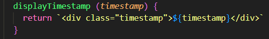
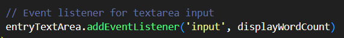
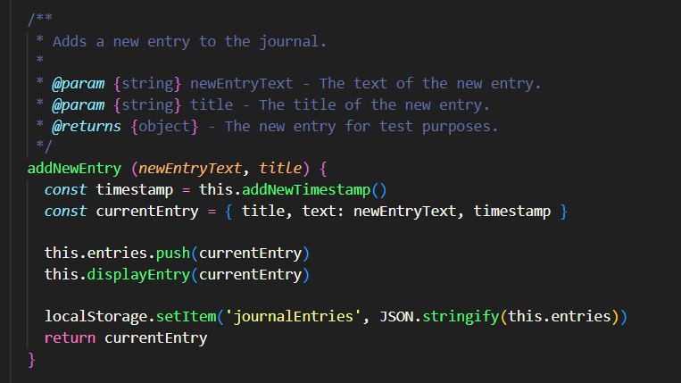
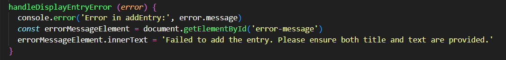
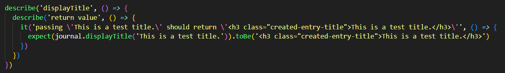

**Report for Laboration 3**
*Reflektions made from Clean Code by Robert C. Martin and how it has effected my code.*

**Chapter 2 - Meaningful Names**
We should always use names that describe what they are ment to be doing, and vi should avoid disinformation at all cost. Both for us and our fellow programmers. A thing that was pointed out in the book that I didn't really think of but now feel is a very important think to keep in mind is creating "Searchable Names". And especially if you work in a group on a larger project. All in all this is a very good chapter that I always will keep in the back of my mind extra loudly from now on. It has made me even more aware of what I name my functions/methods/classes/anythings really.  

**Chapter 3 - Functions**
This was a chapter that I didn't always agreed with, mostly because it feels like there are real life situations where some of the rules are impossible to follow. Everytime I make a function that is a bit longer I have this book and its "Small!" and "Do One Thing" rules yelling in my head. I do agree that the functions we make should be as small as possible and we shouldn't have a function do too many things, it's just hard sometimes. The "Don't Repeat Yourself" rule is something I have heard since I started programming and I completely agree on this and it's something I always try to follow. I have some very small functions in my code that only does one specific thing ex: () Unfortunately not all functions in my code are as small as this one and I have a few that according to the book might be considered too big.

**Chapter 4 - Comments**
When it comes to comments it's easy to put too many of them, unnecessary or we forget to remove them when our code changes. Personally I often use comments to remind myself of what a line of code is doing.  Here I added the comment to remind myself of what this line does, but it is really unnecessary. If I only take a second to read the line I have all the info I need, so I will end up removing this comment since it doesn't give any more information then the line of code already does. So this is a typical example of a redundant comment, and in the moment I felt like I really needed it, but now coming back to it I can see it doesn't add anything. 

**Chapter 5 - Formatting**
This chapter mentions "The Newspaper Metaphor" and to me this is why I want to have proper documentation throughout my code. Here is an example of a method in my code:  and I think this follows the "The Newspaper Metaphor" in the way that you start at the top, you get inormation about the "article" and then you have the actualt "article" meaning the actual method.Two points that the book mentions is "Vertical Distance" and "Vertical Density" and where we want to keep functions/methods that belong together close to eachother. Lines opf code that are important to eachother shold be close together (density) and concepts that are closely related should also be close together (distance). When I made my tests I tried to keep all my "add" tests close together and the same for the "dispaly" tests (LINK TO THIS).

**Chapter 6 - Objects and Data Structures**
For this assignment we were told to use a object-oriented approach. To do this I have my two classes, the Journal class and the TextAnalysis class. My Journal class acts as an object that manages the journal entries in the journal application. 
I was looking through my code to see if I could find any unintentional "Train Wrecks" and I was happy to see that I hadn't managed to make any. 

**Chapter 7 - Error Handeling**
So in chapter 3 we learn that error handeling functions should do only that and nothing else. I did try to do this with this example:  but I also have some try-catch in functions that does other things. A thing that we learn in this chapter is that we "Don't Retuns Null" and "Don't Pass Null", null is bad in this case and I have followed this rule. The chapert also mentions separating concernes and I did try to do that. As I was adding error handling I realised my metthods grew a lot. Therefore I tried to break some of it out.

**Chapter 8 - Boundaries**
In my application I pretty much have only simple code I made. I do use localStorage to store the entries a user creates in the application. For this assignment we were supposed to create all the code on our own and that's why it's all very simple and I'm not using any fancy APIs or anything. At the end of this chapter the author mentions that is't always better to denpend on something we can control rather than something we don't really have control over. And this is a very important thing to take away from this chaper. Of course this is porbably much easier in a smaller project or a personal project where we're the boss. 

**Chapter 9 - Unit Tests**
The book mentions that our test should be "Clean Tests" and the most important part is readability.  This is one of the tests for my application, all my automatic tests look simillar and I have tried to make them as readable as possible, mostly for myself. According to the book clean tests follow five rules; Fast, Independent, Repeatable, Self-Validating. A when it comes to the second rule, independent I had some troubble with this one. In my tests when I test addNewEntry, that sets up a copy of my Journal that then gets used when I run the test for deleteEntry. So of course this is not optimal, but that is the reality of my situation right now, it's not perfect.

**Chapter 10 - Classes**
So, the book has the same philosophy for classes and functions, they should be small. I have two classes in my code, Journal class and TextAnalysis class (LINK THEM), and I don't think Robert C. Martin would agree that they are short. I think it's more difficult to keep the classes short, it was in this case at least. There is also "The Single Responsibility Principle" and this I feel like I have managed to follow. The Journal class is only related to the journal part of the application and the TextAnalysis class is related to the methods created in the module I made for L2. 

**Chapter 11 - Systems**
When mentioning scaling up the book has the example of a city, and how we start small and expand and build, the same is for development and writing code. We can't get things right on the first try, this goes without saying. The book talks about implementing, refactoring and expanding the system and this is something that I saw in my application too. Even though it is a very small simple app I saw what I needed to add as a built it. I realised after a while that I had a lot of spagetti code and I had to refactor a lot of things. And even now as I'm writing this report I find things I want to add, change, remove. 